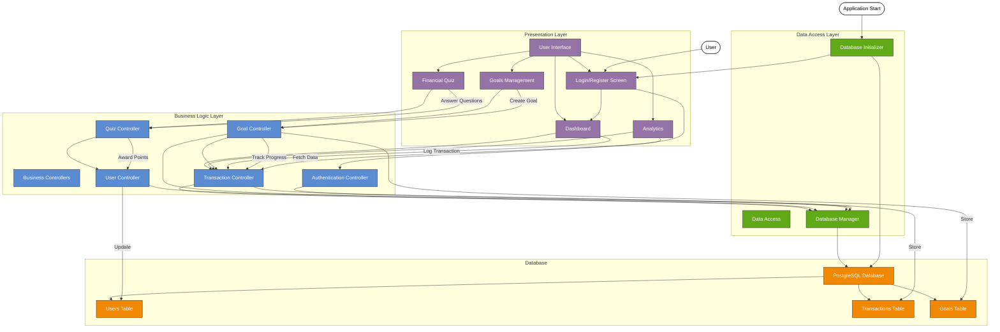

```mermaid
flowchart TB
    %% Define the main layers
    subgraph "Presentation Layer"
        UI["User Interface"]
        UI_Login["Login/Register Screen"]
        UI_Dashboard["Dashboard"]
        UI_Goals["Goals Management"]
        UI_Quiz["Financial Quiz"]
        UI_Analytics["Analytics"]
    end

    subgraph "Business Logic Layer"
        BC["Business Controllers"]
        BC_Transaction["Transaction Controller"]
        BC_Goal["Goal Controller"]
        BC_User["User Controller"]
        BC_Auth["Authentication Controller"]
        BC_Quiz["Quiz Controller"]
    end

    subgraph "Data Access Layer"
        DA["Data Access"]
        DB_Manager["Database Manager"]
        DB_Init["Database Initializer"]
    end

    subgraph "Database"
        DB["PostgreSQL Database"]
        DB_Users["Users Table"]
        DB_Transactions["Transactions Table"]
        DB_Goals["Goals Table"]
    end

    %% Link components in the presentation layer
    UI --> UI_Login
    UI --> UI_Dashboard
    UI --> UI_Goals
    UI --> UI_Quiz
    UI --> UI_Analytics

    %% Connect Presentation to Business Logic
    UI_Login --> BC_Auth
    UI_Dashboard --> BC_Transaction
    UI_Goals --> BC_Goal
    UI_Quiz --> BC_Quiz
    UI_Analytics --> BC_Transaction
    
    %% Link controllers to each other
    BC_Goal --> BC_Transaction
    BC_Quiz --> BC_User
    
    %% Connect Business Logic to Data Access
    BC_Transaction --> DB_Manager
    BC_Goal --> DB_Manager
    BC_User --> DB_Manager
    BC_Auth --> DB_Manager
    
    %% Connect Data Access to Database
    DB_Manager --> DB
    DB_Init --> DB
    
    %% Database tables
    DB --> DB_Users
    DB --> DB_Transactions
    DB --> DB_Goals
    
    %% Application startup flow
    Start([Application Start]) --> DB_Init
    DB_Init --> UI_Login
    UI_Login --> UI_Dashboard
    
    %% Data flow for key features
    User([User]) --> UI_Login
    UI_Dashboard -- "Log Transaction" --> BC_Transaction
    BC_Transaction -- "Store" --> DB_Transactions
    UI_Goals -- "Create Goal" --> BC_Goal
    BC_Goal -- "Store" --> DB_Goals
    BC_Goal -- "Track Progress" --> BC_Transaction
    UI_Quiz -- "Answer Questions" --> BC_Quiz
    BC_Quiz -- "Award Points" --> BC_User
    BC_User -- "Update" --> DB_Users
    UI_Analytics -- "Fetch Data" --> BC_Transaction
    
    %% Style nodes
    classDef presentation fill:#9673A6,stroke:#333,stroke-width:1px,color:white;
    classDef business fill:#5B8BD0,stroke:#333,stroke-width:1px,color:white;
    classDef dataAccess fill:#60A917,stroke:#333,stroke-width:1px,color:white;
    classDef database fill:#F08705,stroke:#333,stroke-width:1px,color:white;
    classDef flow fill:#FFFFFF,stroke:#333,stroke-width:1px,color:black;
    
    class UI,UI_Login,UI_Dashboard,UI_Goals,UI_Quiz,UI_Analytics presentation;
    class BC,BC_Transaction,BC_Goal,BC_User,BC_Auth,BC_Quiz business;
    class DA,DB_Manager,DB_Init dataAccess;
    class DB,DB_Users,DB_Transactions,DB_Goals database;
    class Start,User flow;
``` 