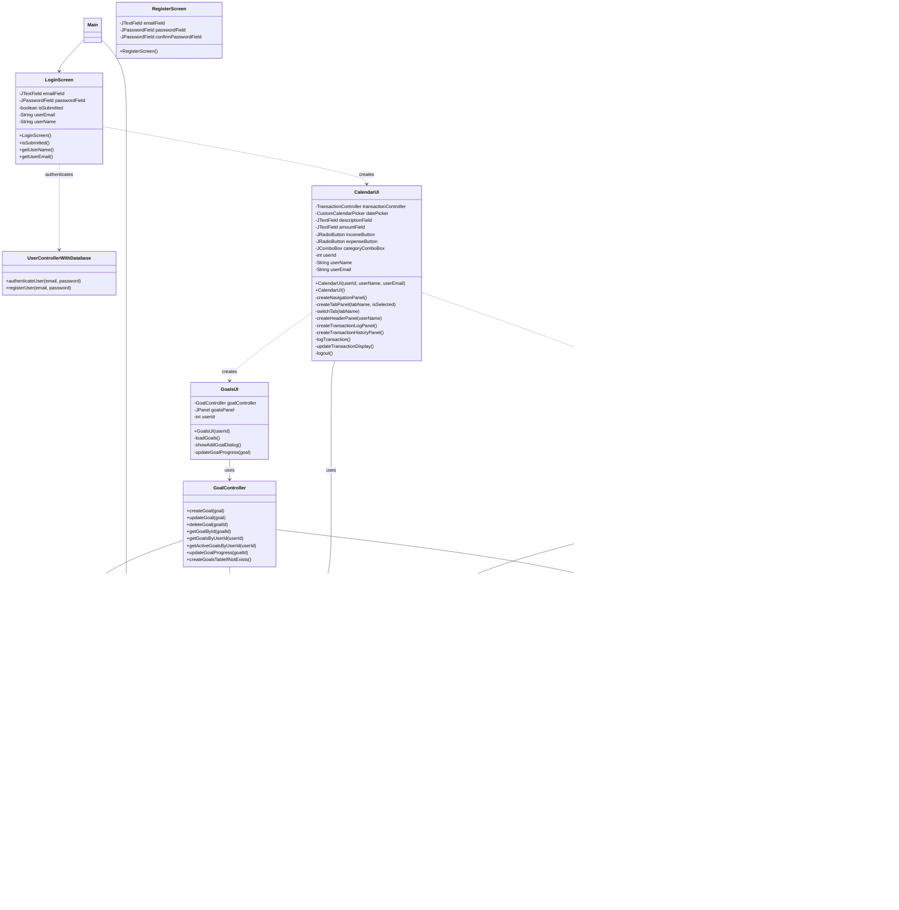

```mermaid
classDiagram
    %% Main Application
    Main --> LoginScreen
    Main --> DatabaseInitializer
    
    %% Model Classes
    class User {
        -int id
        -String username
        -String email
        -double balance
        -int points
        +User(username, email, balance)
        +User(id, username, email, balance, points)
        +getId()
        +getUsername()
        +getEmail()
        +getBalance()
        +getPoints()
        +addPoints(amount)
        +updateBalance(amount)
    }
    
    class Transaction {
        -int id
        -int userId
        -String description
        -double amount
        -LocalDate date
        -boolean isIncome
        -String category
        +Transaction(description, amount, date, isIncome)
        +Transaction(description, amount, date, isIncome, category)
        +Transaction(id, userId, timestamp, description, category, type, amount)
        +getId()
        +getUserId()
        +getDescription()
        +getAmount()
        +getDate()
        +isIncome()
        +getCategory()
        +getType()
        +toString()
    }
    
    class Goal {
        -int id
        -int userId
        -String title
        -String description
        -double targetAmount
        -double currentAmount
        -Date startDate
        -Date targetDate
        -String category
        -boolean completed
        +Goal(userId, title, description, targetAmount, startDate, targetDate, category)
        +Goal(id, userId, title, description, targetAmount, currentAmount, startDate, targetDate, category, completed)
        +getProgressPercentage()
        +getDaysRemaining()
        +isAtRisk()
    }
    
    class Quiz {
        -List~QuizQuestion~ questions
        -int currentQuestionIndex
        -int score
        +Quiz()
        +addQuestion(question)
        +getCurrentQuestion()
        +checkAnswer(selectedAnswerIndex)
        +nextQuestion()
        +getScore()
    }
    
    class QuizQuestion {
        -String question
        -List~String~ options
        -int correctAnswerIndex
        -int points
        +QuizQuestion(question, options, correctAnswerIndex, points)
        +getQuestion()
        +getOptions()
        +checkAnswer(selectedIndex)
        +getPoints()
    }
    
    %% Controller Classes
    class UserController {
        -String username
        -String email
        -double balance
        +UserController(username, email, balance)
        +getUsername()
        +getEmail()
        +getBalance()
        +addPoints(amount)
    }
    
    class UserControllerWithDatabase {
        +authenticateUser(email, password)
        +registerUser(email, password)
    }
    
    class TransactionController {
        -Connection connection
        -int userId
        +TransactionController()
        +setUserId(userId)
        +addTransaction(description, amount, date, isIncome, category)
        +getTransactions()
        +deleteTransaction(transactionId)
        +getAllTransactions(userId)
        +getTransactionsByCategoryAndDateRange(userId, category, startDate, endDate)
    }
    
    class GoalController {
        +createGoal(goal)
        +updateGoal(goal)
        +deleteGoal(goalId)
        +getGoalById(goalId)
        +getGoalsByUserId(userId)
        +getActiveGoalsByUserId(userId)
        +updateGoalProgress(goalId)
        +createGoalsTableIfNotExists()
    }
    
    class QuizController {
        -Quiz quiz
        -UserController userController
        +QuizController(userController)
        +getQuiz()
        +submitAnswer(selectedAnswerIndex)
        +nextQuestion()
    }
    
    %% View Classes
    class LoginScreen {
        -JTextField emailField
        -JPasswordField passwordField
        -boolean isSubmitted
        -String userEmail
        -String userName
        +LoginScreen()
        +isSubmitted()
        +getUserName()
        +getUserEmail()
    }
    
    class RegisterScreen {
        -JTextField emailField
        -JPasswordField passwordField
        -JPasswordField confirmPasswordField
        +RegisterScreen()
    }
    
    class CalendarUI {
        -TransactionController transactionController
        -CustomCalendarPicker datePicker
        -JTextField descriptionField
        -JTextField amountField
        -JRadioButton incomeButton
        -JRadioButton expenseButton
        -JComboBox categoryComboBox
        -int userId
        -String userName
        -String userEmail
        +CalendarUI(userId, userName, userEmail)
        +CalendarUI()
        -createNavigationPanel()
        -createTabPanel(tabName, isSelected)
        -switchTab(tabName)
        -createHeaderPanel(userName)
        -createTransactionLogPanel()
        -createTransactionHistoryPanel()
        -logTransaction()
        -updateTransactionDisplay()
        -logout()
    }
    
    class GoalsUI {
        -GoalController goalController
        -JPanel goalsPanel
        -int userId
        +GoalsUI(userId)
        -loadGoals()
        -showAddGoalDialog()
        -updateGoalProgress(goal)
    }
    
    class QuizUI {
        -QuizController quizController
        -JPanel contentPanel
        +QuizUI(quizController)
        -showQuestion()
        -showQuizFinished()
    }
    
    %% Database Classes
    class DatabaseManager {
        -String URL
        -String USER
        -String PASSWORD
        +getConnection()
    }
    
    class DatabaseInitializer {
        +initializeDatabase()
        -createTables(conn)
    }
    
    %% Relationships
    User "1" -- "many" Transaction : has
    User "1" -- "many" Goal : has
    Quiz "1" *-- "many" QuizQuestion : contains
    
    TransactionController --> DatabaseManager : uses
    TransactionController -- Transaction : manages
    
    GoalController --> DatabaseManager : uses
    GoalController -- Goal : manages
    GoalController --> TransactionController : uses
    
    QuizController -- Quiz : manages
    QuizController --> UserController : uses
    
    LoginScreen ..> UserControllerWithDatabase : authenticates
    LoginScreen ..> CalendarUI : creates
    
    CalendarUI --> TransactionController : uses
    CalendarUI ..> GoalsUI : creates
    CalendarUI ..> QuizUI : creates
    
    GoalsUI --> GoalController : uses
    
    QuizUI --> QuizController : uses
    
    DatabaseInitializer --> DatabaseManager : uses
``` 